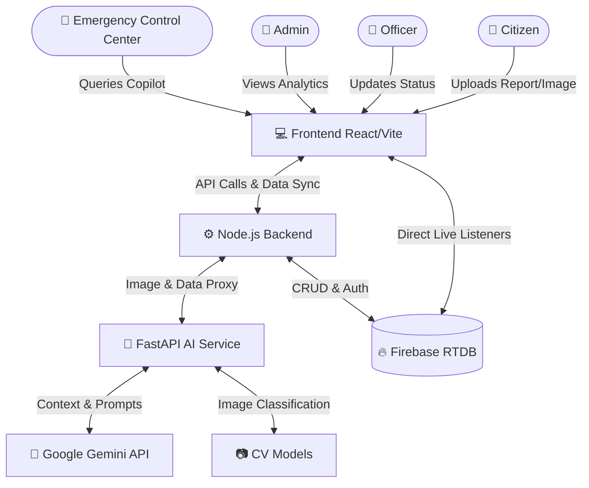

<div align="center">
  <h1>🚨 CrisisIQ</h1>
  <h3>AI-Powered Government Crisis Management Platform</h3>
  <br />
  
  <br /><br />
  
  
  
  
  
  
  
  
  
</div>

---

## 📖 Overview

**CrisisIQ** is an advanced, AI-driven crisis management and infrastructure intelligence platform designed for modern governments. By bridging the gap between citizens reporting local issues and the authorities managing them, CrisisIQ establishes a streamlined, intelligent, and highly responsive ecosystem for urban emergency management.

In rapidly developing urban environments, critical infrastructure failures (such as severe road damage or flooding) and medical emergencies often suffer from massive communication delays, inefficient manual routing, and a lack of real-time prioritization. Officers and emergency control centers are overwhelmed with unverified data, leading to slow response times that can risk public safety and infrastructure integrity.

CrisisIQ solves this by introducing an end-to-end autonomous pipeline. Citizens report incidents natively from their devices, which are instantly analyzed by state-of-the-art Computer Vision and LLM models (Google Gemini). The AI calculates priority scores, filters duplicates, predicts failure risks, and autonomously dispatches tickets to the correct municipal department—all while maintaining an unprecedented level of transparency and gamified engagement for the citizen.

---

## ✨ Key Features

- **👤 Citizen Portal**: A gamified dashboard allowing users to upload localized reports, track their resolution status in real-time, and earn coins via a community leaderboard.
- **👷 Officer Portal**: A dedicated workspace for field workers (PWD, Municipality) to receive AI-assigned complaints, update repair statuses, and add engineering notes.
- **👑 Admin Dashboard**: A high-level view for government officials to monitor overall infrastructure health, citizen engagement, and AI performance summaries.
- **🏢 Emergency Control Center**: A mission-control environment featuring live IoT alerts, traffic monitoring, hospital capacity dashboards, and active incident mapping.
- **🤖 AI Copilot**: A context-aware Gemini-powered conversational assistant that allows control center operators to query live Firebase data using natural language.
- **📷 AI Road Damage Detection**: Automated Computer Vision classification of uploaded imagery to verify reports before they reach human operators.
- **📊 AI Priority Score**: A dynamic scoring system (0-100) that evaluates incident severity against historical data, weather, and traffic density.
- **🏥 Hospital Intelligence**: Real-time tracking of ICU beds, blood availability, and triage wait times.
- **🚑 Smart Ambulance Routing**: AI-suggested emergency routing recommendations based on current traffic and hospital loads.
- **📈 Predictive Analytics**: Machine learning models predicting the risk of road failure or infrastructure collapse based on weather and traffic volumes.
- **⏪ Incident Replay**: A visual timeline allowing administrators to forensically review the exact lifecycle of an emergency event from report to resolution.
- **🌐 IoT Monitoring**: Integration points for live traffic cameras and flood sensors.
- **🔔 Notifications**: Real-time role-based alerts pushing critical updates to the right personnel instantly.
- **🔍 Duplicate Detection**: Geographic algorithms that merge nearby reports of the same incident to prevent ticket spam.
- **🏆 Leaderboard**: Citizen ranking system based on the accuracy and volume of verified infrastructure reports.
- **📍 Live Tracking**: Interactive Map interface detailing real-time incident clusters across the city.

---

## 🧠 AI Features

CrisisIQ relies heavily on Artificial Intelligence to automate triage and accelerate response times:

- **Computer Vision (MobileNetV2)**: Automatically scans uploaded citizen photos, classifying severity (Mild, Moderate, Severe) and confidence levels without human intervention.
- **Google Gemini Integration**: Powers the system's analytical generation and conversational copilot, extracting operational insights from massive real-time data dumps.
- **AI Priority Score Algorithm**: Weighs the visual severity against contextual metadata to output a numeric priority, guaranteeing that high-risk incidents are surfaced immediately.
- **Predictive Risk Models**: Evaluates historical complaints, average traffic volume, and forecast rainfall to warn administrators of impending infrastructure failure *before* it happens.
- **Decision Support System**: Generates human-readable "Reasons" explaining exactly *why* the AI assigned a specific priority or routed a ticket to a certain department.
- **Conversational AI**: Transforms the Emergency Control Center into an interactive chat interface, allowing operators to ask questions like "Are there any critical floods near City Hospital?" and receive formatted, contextual answers.

---

## 🏛️ System Architecture



---

## 🛠️ Tech Stack

| Category | Technologies Used |
| :--- | :--- |
| **Frontend** | React, Vite, TailwindCSS, React Router, React Markdown |
| **Backend** | Node.js, Express.js, Python, FastAPI |
| **Database** | Firebase Realtime Database |
| **Authentication** | Firebase Authentication (Email/Password) |
| **AI / Machine Learning** | Google Gemini API (Flash), PyTorch, TorchVision (MobileNetV2) |
| **Deployment** | Render (Web Services & Static Sites) |
| **Maps** | Leaflet, React-Leaflet |
| **Tools & Libraries** | Axios, Multer, FormData, Dotenv |

---

## 📂 Folder Structure

```
CrisisIQ/
│
├── Ai-service/                # Python FastAPI Backend
│   ├── ai_service.py          # Core AI endpoints and Gemini Integration
│   └── requirements.txt       # Python dependencies
│
├── Frontend/                  # React Vite Frontend
│   ├── public/                # Static assets
│   ├── src/                   # React source code
│   │   ├── components/        # Reusable UI components
│   │   ├── pages/             # Dashboard and Role Views
│   │   ├── firebase.js        # Firebase configuration
│   │   ├── App.jsx            # Routing and Auth state
│   │   └── main.jsx           # Entry point
│   ├── package.json           
│   ├── vite.config.js         
│   └── .env                   # Frontend Environment Variables
│
├── server/                    # Node.js Express Backend
│   ├── index.js               # Core routing, IoT, and API gateway
│   ├── package.json           
│   └── uploads/               # Temporary image storage
│
├── .gitignore
└── README.md
```

---

## 🚀 Installation

### 1. Clone the Repository
```bash
git clone https://github.com/your-username/CrisisIQ.git
cd CrisisIQ
```

### 2. Frontend Setup
```bash
cd Frontend
npm install
# Create a .env file (see Environment Variables section)
npm run dev
```

### 3. Node Backend Setup
```bash
cd ../server
npm install
# Create a .env file (see Environment Variables section)
node index.js
```

### 4. AI Server Setup (Python)
```bash
cd ../Ai-service
pip install -r requirements.txt
# Create a .env file (see Environment Variables section)
uvicorn ai_service:app --port 8000 --reload
```

---

## 🔐 Environment Variables

You must create a `.env` file in all three service directories.

### `Frontend/.env`
```env
VITE_API_URL="http://localhost:5001"
VITE_AI_URL="http://127.0.0.1:8000"
VITE_FIREBASE_API_KEY="your-api-key"
VITE_FIREBASE_AUTH_DOMAIN="your-domain.firebaseapp.com"
VITE_FIREBASE_DATABASE_URL="https://your-database.firebasedatabase.app/"
VITE_FIREBASE_PROJECT_ID="your-project-id"
VITE_FIREBASE_STORAGE_BUCKET="your-bucket.firebasestorage.app"
VITE_FIREBASE_MESSAGING_SENDER_ID="your-sender-id"
VITE_FIREBASE_APP_ID="your-app-id"
VITE_FIREBASE_MEASUREMENT_ID="your-measurement-id"
```

### `server/.env`
```env
PORT=5001
AI_SERVICE_URL="http://127.0.0.1:8000"
```

### `Ai-service/.env`
```env
GEMINI_API_KEY="your-google-gemini-api-key"
```

---

## 📸 Screenshots

| Citizen Dashboard | Officer Portal |
| :---: | :---: |
|  |  |

| Emergency Control Center | CrisisIQ AI Copilot |
| :---: | :---: |
|  |  |

| Admin Dashboard | Incident Replay |
| :---: | :---: |
|  |  |

---

## 🔄 Core Workflow

1. **Citizen Upload** 📱: User captures a photo of a hazard and submits via the portal.
2. **AI Detection** 🧠: Computer Vision models determine the damage type and severity.
3. **Priority Score** 📊: System generates an automated priority out of 100 based on external factors.
4. **Department Routing** 🏢: The incident is autonomously assigned to the relevant department (e.g., PWD, Municipality).
5. **Officer Dispatch** 👷: Field officer receives the ticket in real-time, adds notes, and begins repairs.
6. **Hospital/Emergency Routing** 🚑 *(if applicable)*: Ambulances are dispatched via optimized routing if casualties are detected.
7. **Completion** ✅: Officer marks the incident as resolved.
8. **Citizen Notification** 🪙: The reporting citizen receives an update and is awarded leaderboard coins.

---

## 🔮 Future Scope

- 🚁 **Drone Integration**: Autonomous drone dispatch for secondary visual verification of critical structural complaints.
- 🛰️ **Satellite Data**: Overlaying real-time weather and topographical satellite feeds into the AI prediction engine.
- 🏙️ **Digital Twin**: Constructing a 3D structural model of the city to visualize stress points.
- 🚦 **Smart City Traffic Cameras**: Native integration to passively detect potholes and accidents without citizen intervention.
- 🌪️ **Disaster Forecasting**: Advanced LLM integration to predict large-scale resource allocation requirements during natural disasters.
- 🌍 **Multi-city Deployment**: Scaling the Firebase architecture to support segmented geographic regions and states.

---

## 👨‍💻 Authors

**Your Name**  
GitHub: [@yourusername](https://github.com/yourusername)

---

## 📄 License

This project is licensed under the [MIT License](LICENSE).

---

## 🙌 Acknowledgements

- [Google Gemini API](https://deepmind.google/technologies/gemini/)
- [Firebase Realtime Database & Auth](https://firebase.google.com/)
- [Render Deployment Platform](https://render.com/)
- [React](https://react.dev/) & [FastAPI](https://fastapi.tiangolo.com/)
- [PyTorch & MobileNetV2](https://pytorch.org/)
- [Leaflet.js](https://leafletjs.com/)
